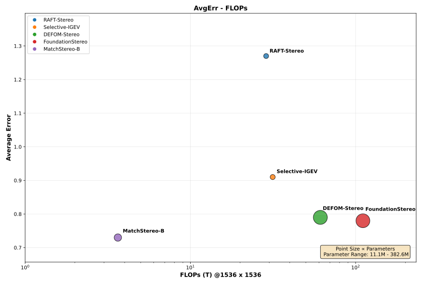
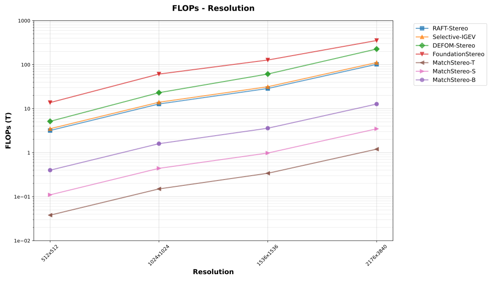
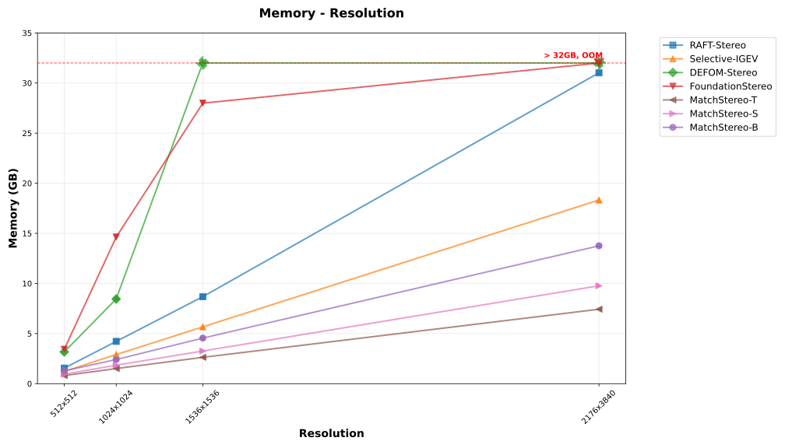
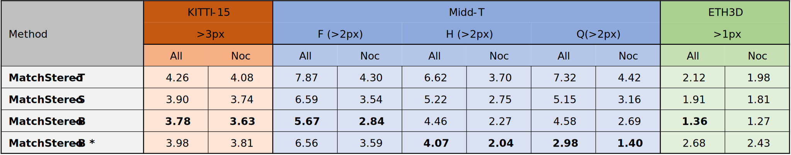

# MatchAttention: Matching the Relative Positions for High-Resolution Cross-View Matching

Official implementation of our paper [[arxiv link]](https://arxiv.org/abs/2510.14260)

Authors: Tingman Yan, Tao Liu, Xilian Yang, Qunfei Zhao, Zeyang Xia

# Abstract
> Cross-view matching is fundamentally achieved through cross-attention mechanisms. However, matching of high-resolution images remains challenging due to the quadratic complexity and lack of explicit matching constraints in the existing cross-attention. This paper proposes an attention mechanism, MatchAttention, that dynamically matches relative positions. The relative position determines the attention sampling center of the key-value pairs given a query. Continuous and differentiable sliding-window attention sampling is achieved by the proposed **BilinearSoftmax**. The relative positions are iteratively updated through residual connections across layers by embedding them into the feature channels. Since the relative position is exactly the learning target for cross-view matching, an efficient hierarchical cross-view decoder, MatchDecoder, is designed with MatchAttention as its core component. To handle cross-view occlusions, gated cross-MatchAttention and a consistency-constrained loss are proposed. These two components collectively mitigate the impact of occlusions in both forward and backward passes, allowing the model to focus more on learning matching relationships. When applied to stereo matching, **MatchStereo-B ranked 1st in average error on the public Middlebury benchmark and requires only 29ms for KITTI-resolution inference. MatchStereo-T can process 4K UHD images in 0.1 seconds using only 3GB of GPU memory.** The proposed models also achieve state-of-the-art performance on KITTI 2012, KITTI 2015, ETH3D, and Spring flow datasets. The combination of high accuracy and low computational complexity makes real-time, high-resolution, and high-accuracy cross-view matching possible.

**TLDR**: An contiguous and differentiable sliding-window attention mechanism, MatchAttention, that enables long-range connection, explict matching, and linear complexity. Real-time and state-of-the-arts performance for stereo matching and optical flow.

MatchStereo has orders of magnitude fewer FLOPs than SOTA methods and has achieved the lowest AvgErr on the Middlebury benchmark. Its memory usage increases linearly with respect to image resolution.

 

 

Both model variants have strong zero-shot generalization on real-world datasets when trained on FSD Mix datasets.

The inference time for MatchStereo-T is 38ms@1536x1536 and 95ms@2176x3840 (FP16 with torch.compile enabled on a single RTX 5090 GPU).

## Code coming soon (ETA November)